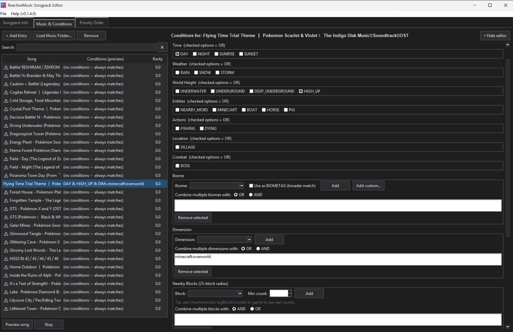

# ReactiveMusic Songpack Maker

<p align="center">
  
</p>

<p align="center">
  <a href="https://github.com/pablocbamorim/rm-songpack-maker/releases/tag/v0.1.5.0-alpha"><strong>Download for Windows</strong></a>
  &nbsp;|&nbsp;
  <a href="https://github.com/pablocbamorim/rm-songpack-maker/releases"><strong>View Releases</strong></a>
</p>

A desktop editor for creating and maintaining songpacks for the [ReactiveMusic](https://github.com/CircuitLord/ReactiveMusic) Minecraft mod.

ReactiveMusic songpacks contain a `ReactiveMusic.yaml` configuration file and a `music` folder with the audio files referenced by that configuration. This program provides a graphical interface for building that YAML instead of editing it by hand.

## What it does

<p align="center">
  
</p>

The editor currently provides:

- Songpack metadata editing: name, version, author, description, credits, music switch speed, and music delay length.
- Music-folder scanning for `.mp3`, `.ogg`, and `.wav` files.
- Condition editing for ReactiveMusic's fixed event categories: special events, time, weather, world height, entities, actions, location, and combat.
- Dynamic conditions including `BIOME=`, `BIOMETAG=`, `DIM=`, and `BLOCK=`.
- Custom biome and biome-tag definitions with display colors.
- Advanced entry behavior such as `allowFallback`, force-stop/start options, and `forceChance`.
- Raw-condition editing for conditions the structured editor does not recognize.
- Automatic rarity/specificity scoring and recommended priority ordering.
- Manual priority reordering, search/filtering, and warnings for entries with no conditions.

The priority score is an editor-side heuristic. ReactiveMusic itself evaluates entries from top to bottom and uses the first matching entry.

## Windows installation

**For normal users, use the download button at the top of this page.**

1. Click **Download for Windows** above, or open the [Releases](https://github.com/pablocbamorim/rm-songpack-maker/releases) page.
2. Download the Windows `.zip` attached to the latest release.
3. Extract the ZIP.
4. Run `SoundpackMaker.exe`.

The executable is portable. Python does not need to be installed, and there is currently no traditional installer.

GitHub Actions also produces development artifacts, but Releases are the recommended download method for users.

## Running from source

Use Python 3.12 or another compatible Python 3 version with Tkinter available.

```text
python -m pip install -r requirements.txt
python main.py
```

## Creating a songpack

### 1. Start a new songpack

Open **File > New Songpack**. Alternatively, use **Load Music Folder…** to create entries automatically from audio files.

### 2. Fill in Songpack Info

In **Songpack Info**, configure the songpack metadata:

- **Songpack Name** — name/identifier displayed by ReactiveMusic.
- **Version** — version of your songpack, not the editor.
- **Author**, **Description**, **Credits** — metadata written to YAML.
- **Music Switch Speed** — `INSTANT`, `SHORT`, `NORMAL`, or `LONG`.
- **Music Delay Length** — `NONE`, `SHORT`, `NORMAL`, or `LONG`.

### 3. Load your music

Go to **Music & Conditions** and click **Load Music Folder…**. The editor scans `.mp3`, `.ogg`, and `.wav` files and uses each filename without its extension as the song identifier.

For example:

```text
music/
├── Route 10.mp3
├── Battle Theme.ogg
└── Cave.wav
```

creates entries for `Route 10`, `Battle Theme`, and `Cave`.

**Important:** `Save Config…` currently does not copy the audio files. Make sure the referenced files are present in the songpack's `music` folder yourself.

### 4. Configure conditions

Select an entry and configure when it can play. Conditions within a category are OR'd, while different condition categories are represented as separate event requirements and therefore act as AND conditions.

For example:

```yaml
- events: ["DAY", "BIOME=forest"]
  songs:
    - "MySong"
```

requires both daytime and a matching forest biome.

The editor supports:

```text
BIOME=...
BIOMETAG=...
DIM=...
BLOCK=...,count
```

It also preserves raw conditions it does not recognize instead of silently discarding them.

### 5. Configure advanced behavior

The **Advanced / Fallback Behaviour** section exposes ReactiveMusic options such as `allowFallback`, `forceStopMusicOnChanged`, `forceStopMusicOnValid`, `forceStopMusicOnInvalid`, `forceStartMusicOnValid`, and `forceChance`.

### 6. Check priority

Open **Priority Order**. ReactiveMusic evaluates entries from top to bottom and plays the first entry whose conditions are valid. Specific entries therefore generally need to be above broad entries that would also match.

Use **Auto-arrange by rarity (recommended)**, then adjust the order manually if necessary. Entries with no conditions always match and should normally be kept low in the list unless that is intentional.

### 7. Save the songpack

Use **File > Save Config…**. The editor writes:

```text
Your Songpack/
├── ReactiveMusic.yaml
└── biome_customization.json
```

Then create a `music` folder and put the referenced audio files inside it:

```text
Your Songpack/
├── ReactiveMusic.yaml
├── biome_customization.json
└── music/
    ├── Route 10.mp3
    ├── Battle Theme.ogg
    └── Cave.wav
```

`biome_customization.json` is editor metadata for custom biome/biome-tag display colors; ReactiveMusic does not use it for its event logic.

## Installing the finished songpack in Minecraft

ReactiveMusic's songpack documentation places songpacks in Minecraft's `resourcepacks` directory. Despite the directory name, these are selected through ReactiveMusic rather than behaving like normal resource packs.

```text
.minecraft/
└── resourcepacks/
    └── My Songpack/
        ├── ReactiveMusic.yaml
        ├── biome_customization.json
        └── music/
            ├── Song A.mp3
            └── Song B.mp3
```

Launch Minecraft with ReactiveMusic installed and use:

```text
/reactivemusic
```

to open the songpack menu and select your songpack.

## Testing and debugging

ReactiveMusic's documentation recommends enabling debug mode while testing a songpack. It makes songs switch whenever their events become valid and removes silence gaps.

For additional debugging:

```text
/reactivemusic toggleLogging
/reactivemusic logBlockCounter
```

The second command is useful when configuring nearby-block conditions.

## Supported ReactiveMusic conditions

| Category | Conditions |
| --- | --- |
| Special | `MAIN_MENU`, `CREDITS`, `HOME` |
| Time | `DAY`, `NIGHT`, `SUNRISE`, `SUNSET` |
| Weather | `RAIN`, `SNOW`, `STORM` |
| World height | `UNDERWATER`, `UNDERGROUND`, `DEEP_UNDERGROUND`, `HIGH_UP` |
| Entities | `NEARBY_MOBS`, `MINECART`, `BOAT`, `HORSE`, `PIG` |
| Actions | `FISHING`, `DYING` |
| Location | `VILLAGE` |
| Combat | `BOSS` |
| Dynamic | `BIOME=...`, `BIOMETAG=...`, `DIM=...`, `BLOCK=...,count` |

## YAML compatibility notes

The underlying ReactiveMusic format is YAML, so indentation and structure matter. The editor handles YAML generation for you, but manually editing the generated file should be done carefully.

For the full ReactiveMusic songpack format, see the official [Making Songpacks documentation](https://github.com/CircuitLord/ReactiveMusic/blob/master/docs/MAKING_SONGPACKS.md).

## Project version

The editor uses a four-part version number in the form `0.x.y.z`: `z` is used for smaller fixes/iterations, `y` for a successfully completed larger feature, and `x` for a bundle of larger features.

Current editor build: `0.1.5.0`.

## License and credits

This tool is licensed under the **MIT License**. See [LICENSE](LICENSE).

Created by **Pablo Castelo Branco Amorim** (`pablocbamorim`).

This program was **vibe-coded**: AI tools were used extensively to generate, modify, and debug the code, with the creator directing development and reviewing the resulting changes.

ReactiveMusic itself is developed by **CircuitLord**. This project is an independent editor for ReactiveMusic songpacks and is not affiliated with the upstream project.
