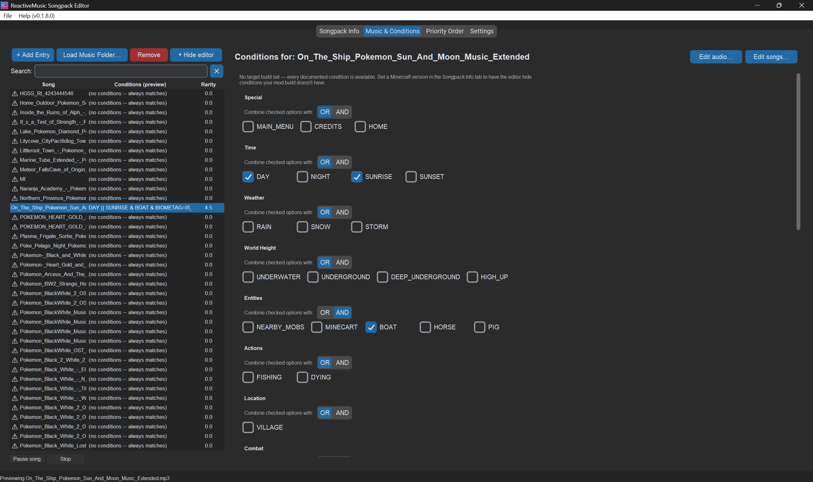
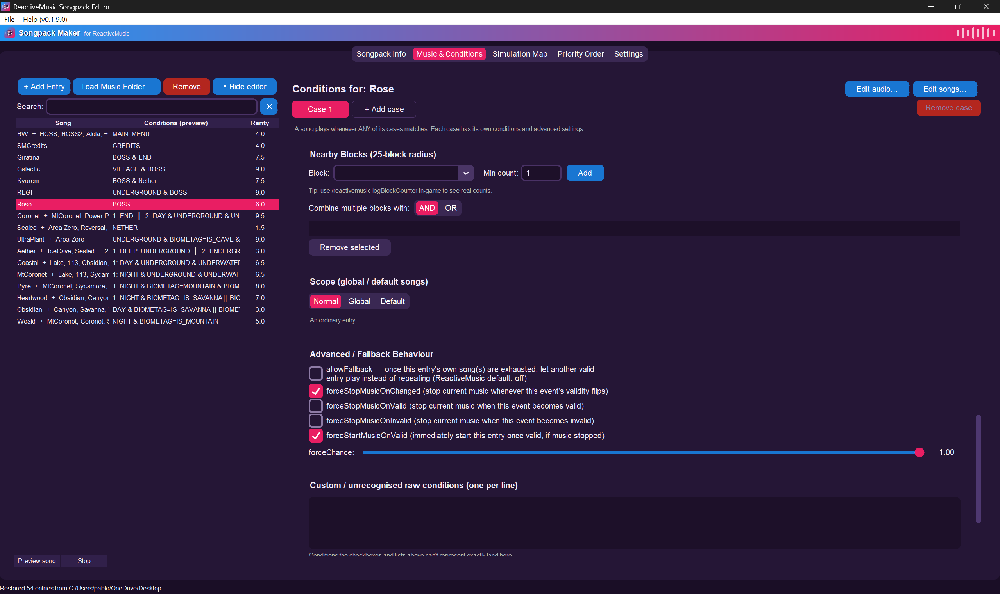
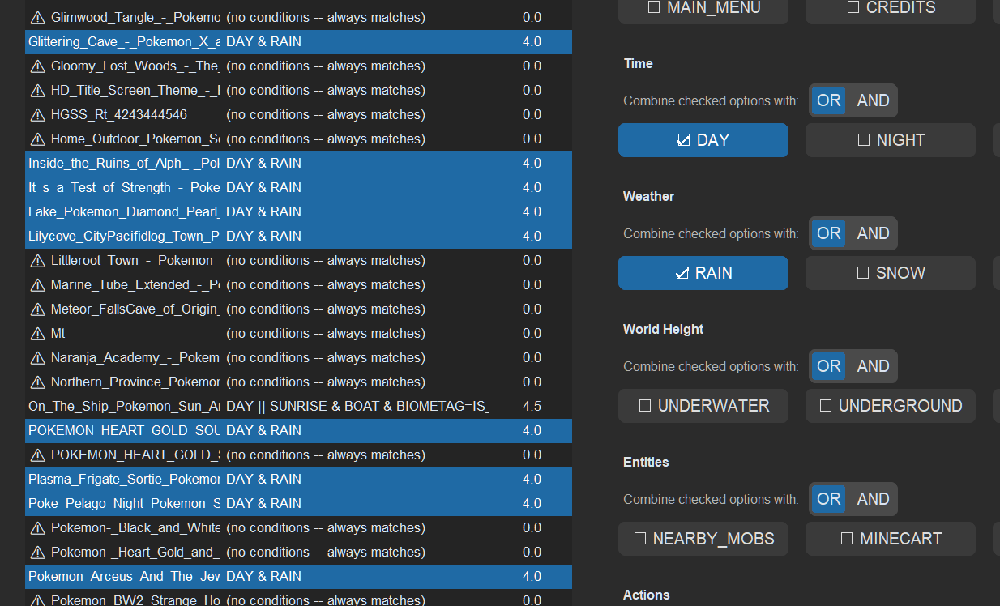
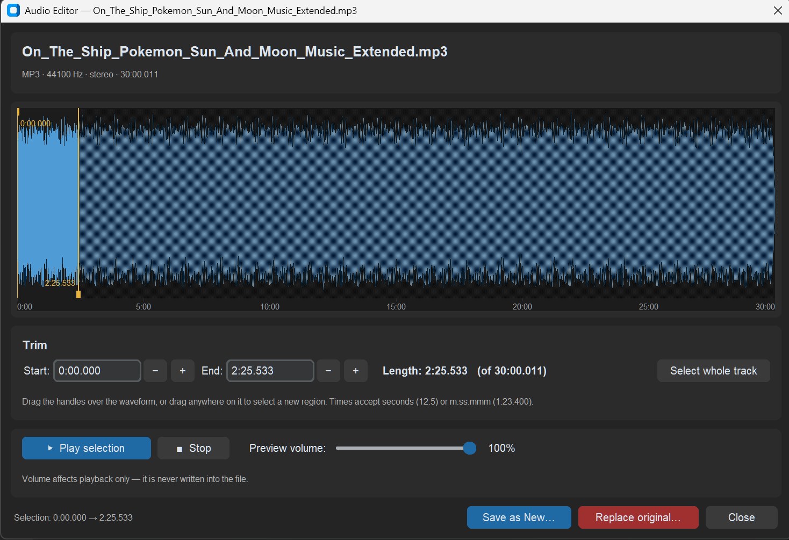
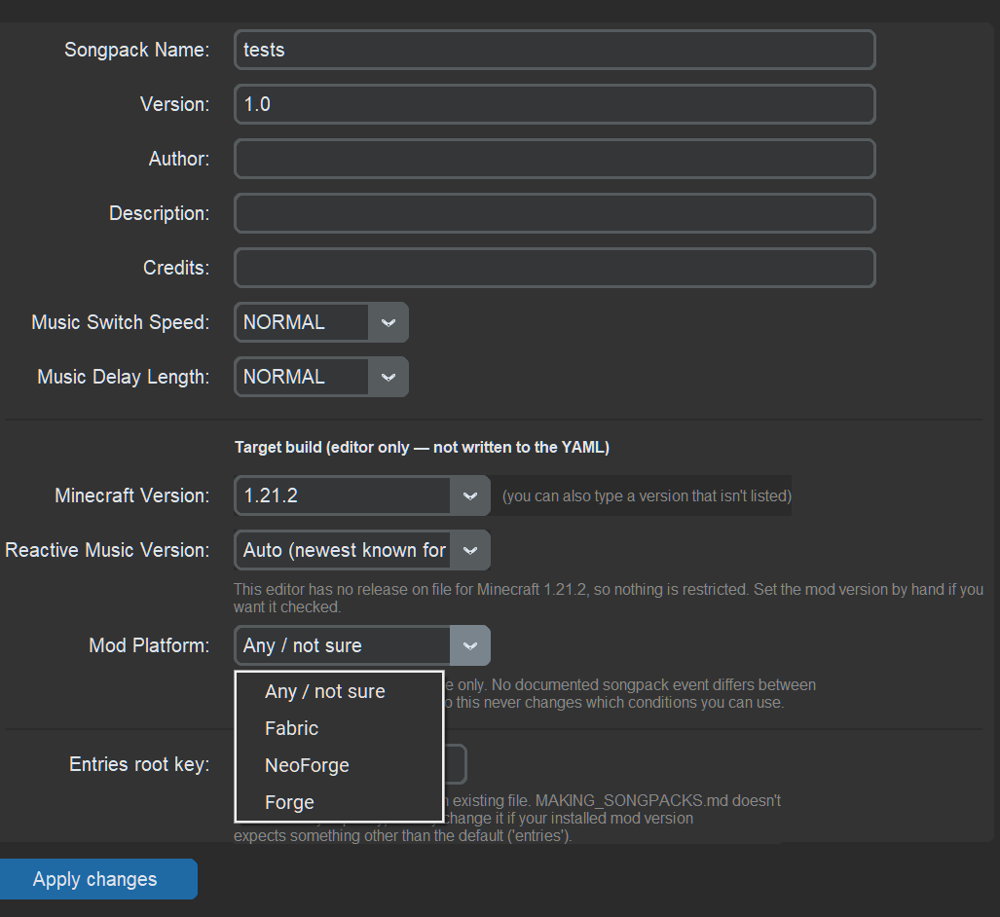

# ReactiveMusic Songpack Maker

<p align="center">
  
</p>

<p align="center">
  <a href="https://github.com/pablocbamorim/rm-songpack-maker/releases/tag/v0.1.8.0"><strong>Download for Windows</strong></a>
  &nbsp;|&nbsp;
  <a href="https://github.com/pablocbamorim/rm-songpack-maker/releases"><strong>View Releases</strong></a>
</p>

A graphical editor for creating songpacks for the [ReactiveMusic](https://github.com/CircuitLord/ReactiveMusic) Minecraft mod.

ReactiveMusic songpacks are configured through a YAML file. You *can* write that YAML by hand, but it means keeping track of indentation, condition syntax, event support, entry priority, song filenames, and ReactiveMusic's many optional settings yourself. This editor turns that process into a GUI: select what you want, see what is available, and let the program generate the configuration for you.

This is especially useful when a songpack grows beyond a few entries. Instead of manually maintaining a large YAML file, you can organize conditions and songs visually, reorder priorities, preview music, and get warnings when something looks wrong.

## Features

- Create and edit songpacks through a graphical interface instead of hand-writing YAML.
- Import songs directly from a music folder and build entries from the detected audio files.
- Configure ReactiveMusic conditions through structured controls, including biome, biome tags, dimensions, blocks, time, weather, and other events.
- Manage custom biome and biome-tag definitions with visual colors.
- Automatically suggest entry priority based on condition specificity, with manual reordering when needed.
- Configure advanced playback behavior such as fallback, force stop/start, and force chance.
- Search and filter entries and get warnings for potentially problematic configurations.

<p align="center">
  
  
</p>

- Edit multiple songs at the same time

<p align="center">
  
</p>

- Preview songs
- Trim and replace tracks as you wish

<p align="center">
  
</p>

- **Biome Simulator** tab: choose a situation (time of day, weather, world height, underwater, plus any other condition), hover or click a biome on the map and see which songs ReactiveMusic would play there, in priority order. Double-click a song to start a playlist that imitates the mod.
- **Global and default songs**: mark a song's case as *Global* (plays in every biome where its conditions hold) or *Default* (fills gaps where no biome-specific entry handles the situation). No per-biome copies are generated; the entry is written with no `BIOME=` and pinned below all normal entries, and **Check global songs…** on the Priority Order tab finds entries that block a global song and can turn `allowFallback` on for them.
- Choose a target Minecraft / ReactiveMusic build so unsupported conditions are identified before saving.
- Keep unsupported or custom conditions instead of losing them when editing a songpack: cross-category ORs such as `BIOME=ocean || UNDERWATER`, several OR groups in one category and unknown YAML keys (for example `alwaysPlay`) are preserved exactly, and the simulator, priority scoring, biome views and version checks all understand them.
- **Check before saving**: songless entries, entries with no conditions and entries that can never play (a broader entry above them has no `allowFallback`) are listed before the file is written; you decide whether to save anyway.

<p align="center">
  
</p>

## Coming soon

- UI improvements and general workflow polish.
- A biome condition editor based on a temperature/humidity chart, making it possible to select biomes visually and combine them with the same condition logic used elsewhere.
- More planned improvements to make building and testing songpacks faster and easier.

## Windows installation

**For normal users, use the download button at the top of this page.**

1. Click **Download for Windows** above, or open the [Releases](https://github.com/pablocbamorim/rm-songpack-maker/releases) page.
2. Download the Windows `.zip` attached to the latest release.
3. Extract the ZIP.
4. Run `SoundpackMaker.exe`.

The executable is portable. Python does not need to be installed, and there is currently no traditional installer.

GitHub Actions also produces development artifacts, but Releases are the recommended download method for users.

## Running from source

Use Python 3.12 or another compatible Python 3 version with Tkinter available.

```text
python -m pip install -r requirements.txt
python main.py
```

## Creating a songpack

### 1. Start a new songpack

Open **File > New Songpack**. Alternatively, use **Load Music Folder…** to create entries automatically from audio files.

### 2. Fill in Songpack Info

In **Songpack Info**, configure the songpack metadata:

- **Songpack Name** — name/identifier displayed by ReactiveMusic.
- **Version** — version of your songpack, not the editor.
- **Author**, **Description**, **Credits** — metadata written to YAML.
- **Music Switch Speed** — `INSTANT`, `SHORT`, `NORMAL`, or `LONG`.
- **Music Delay Length** — `NONE`, `SHORT`, `NORMAL`, or `LONG`.

### 2a. Choose the target build

The same tab has a **Target build** section. It is editor metadata: none of it is written into `ReactiveMusic.yaml`.

- **Minecraft Version** — the version you are building the songpack for. The list covers the versions this editor has release data for, and you can type any other version.
- **Reactive Music Version** — left on *Auto*, this resolves to the newest mod release known for the selected Minecraft version. Set it by hand to target a specific build, or when you are on a Minecraft version the editor has no release data for.
- **Mod Platform** — Fabric, NeoForge or Forge. Recorded for your own reference only; no documented songpack event behaves differently between loaders.

Once a target resolves to a known mod version, the **Music & Conditions** tab disables conditions that build predates and labels them with the version they need. Conditions an entry already uses stay editable so you can remove them, and **Save Config…** warns before writing a songpack that uses conditions newer than its target.

Known feature gates, from the mod's release notes and `MAKING_SONGPACKS.md`:

| Feature | Added in |
| --- | --- |
| `BIOMETAG=` | 0.4.0 |
| `VILLAGE`, `BOSS`, `NEARBY_MOBS`, `allowFallback` | 0.5.0 |
| `BLOCK=...,count` | 1.2.0 |

Anything not listed is treated as always available, so the editor never blocks a condition it has no evidence against. The table lives in `mod_versions.py` and is commented with its sources.

The editor also shows the detected YAML entries root key. Existing files are inspected when loaded; new songpacks use `entries` unless you change it.

### 3. Load your music

Go to **Music & Conditions** and click **Load Music Folder…**. The editor scans `.mp3`, `.ogg`, and `.wav` files and uses each filename without its extension as the song identifier.

For example:

```text
music/
├── Route 10.mp3
├── Battle Theme.ogg
└── Cave.wav
```

creates entries for `Route 10`, `Battle Theme`, and `Cave`.

**Song pools on save:** entries that sit next to each other in the priority order and have identical conditions and flags are written as one YAML entry with several songs. Entries that are *not* adjacent are never merged, because that would move a song above the entries between them. The simulator uses exactly this saved shape. After saving and reloading, such a run appears as a single pool entry.

**Important:** `Save Config…` currently does not copy the audio files. Make sure the referenced files are present in the songpack's `music` folder yourself.

### 4. Configure conditions

Select an entry and configure when it can play. Conditions within a category are OR'd, while different condition categories are represented as separate event requirements and therefore act as AND conditions.

For example:

```yaml
- events: ["DAY", "BIOME=forest"]
  songs:
    - "MySong"
```

requires both daytime and a matching forest biome.

The editor supports:

```text
BIOME=...
BIOMETAG=...
DIM=...
BLOCK=...,count
```

It also preserves raw conditions it does not recognize instead of silently discarding them.

### 5. Configure advanced behavior

The **Advanced / Fallback Behaviour** section exposes ReactiveMusic options such as `allowFallback`, `forceStopMusicOnChanged`, `forceStopMusicOnValid`, `forceStopMusicOnInvalid`, `forceStartMusicOnValid`, and `forceChance`.

### 6. Check priority

Open **Priority Order**. ReactiveMusic evaluates entries from top to bottom and plays the first entry whose conditions are valid. Specific entries therefore generally need to be above broad entries that would also match.

Use **Auto-arrange by rarity (recommended)**, then adjust the order manually if necessary. Entries with no conditions always match and should normally be kept low in the list unless that is intentional.

### 7. Save the songpack

Use **File > Save Config…**. The editor writes:

```text
Your Songpack/
├── ReactiveMusic.yaml
├── biome_customization.json
└── songpack_target.json
```

The second and third files are editor metadata: custom biome/biome-tag display colors, and the target Minecraft/mod version. A fourth, `songpack_scopes.json`, appears only when some entry is marked Global or Default. ReactiveMusic itself does not read any of them.

Create a `music` subfolder and place all referenced audio files there:

```text
Your Songpack/
├── ReactiveMusic.yaml
├── biome_customization.json
└── music/
    ├── Route 10.mp3
    ├── Battle Theme.ogg
    └── Cave.wav
```

`biome_customization.json` is editor metadata for custom biome/biome-tag display colors; ReactiveMusic does not use it for its event logic.

## Simulating what plays in a biome

Open **Biome Simulator** to test a songpack without launching Minecraft.

- The sliders at the top pick exactly one option each for **time of day**, **weather** and **world height**, and a switch toggles **underwater**. **More conditions** (hidden by default) holds the remaining events (`HOME`, `BOSS`, `VILLAGE`, ...) and a manual box for facts the simulator cannot infer, such as `DIM=NETHER`, `BLOCK=nether_bricks,1000` or `BIOMETAG=IS_WET`.
- Hover a biome on the map to see its songs in priority order; click it to pin the list. Double-click a song to start a playlist (needs the music folder loaded); the playing song gets a sound-wave marker.
- The rules follow `MAKING_SONGPACKS.md`: the first valid entry wins, `allowFallback` decides whether the next valid entry is used once an entry's songs are exhausted (otherwise it loops and entries below it are shown dimmed as unreachable), and `forceStop*` flags cut the current song when the situation changes.
- **Biome tags map:** the selector above the map switches between the Biomes map and a Biome tags map in the same style. Each tag is drawn at the average temperature/humidity of the biomes it contains (its colour is the average of theirs), and selecting one edits its `BIOMETAG=` cases. Songs added to a tag play in every biome the tag contains, and show up for those biomes on the Biomes map.
- `forceStopMusicOn*` and `forceStartMusicOnValid` (with `forceChance`) are modelled: a forced start is armed when its entry becomes valid and plays when the music stops (naturally, via Next, or by a force stop).
- Simplifications: songs play in list order (the mod may pick randomly), `musicDelayLength` silences are ignored, and the biome -> `BIOMETAG` table is built in and approximate. Entries that depend on facts the simulator cannot know are reported instead of silently hidden.

## Installing the finished songpack in Minecraft

ReactiveMusic's songpack documentation places songpacks in Minecraft's `resourcepacks` directory. Despite the directory name, these are selected through ReactiveMusic rather than behaving like normal resource packs.

```text
.minecraft/
└── resourcepacks/
    └── My Songpack/
        ├── ReactiveMusic.yaml
        ├── biome_customization.json
        └── music/
            ├── Song A.ogg
            └── Song B.ogg
```

Launch Minecraft with ReactiveMusic installed and use:

```text
/reactivemusic
```

to open the songpack menu and select your songpack.

## Testing and debugging

ReactiveMusic's documentation recommends enabling debug mode while testing a songpack. It makes songs switch whenever their events become valid and removes silence gaps.

For additional debugging:

```text
/reactivemusic toggleLogging
/reactivemusic logBlockCounter
```

The second command is useful when configuring nearby-block conditions.

## Supported ReactiveMusic conditions

| Category | Conditions |
| --- | --- |
| Special | `MAIN_MENU`, `CREDITS`, `HOME` |
| Time | `DAY`, `NIGHT`, `SUNRISE`, `SUNSET` |
| Weather | `RAIN`, `SNOW`, `STORM` |
| World height | `UNDERWATER`, `UNDERGROUND`, `DEEP_UNDERGROUND`, `HIGH_UP` |
| Entities | `NEARBY_MOBS`, `MINECART`, `BOAT`, `HORSE`, `PIG` |
| Actions | `FISHING`, `DYING` |
| Location | `VILLAGE` |
| Combat | `BOSS` |
| Dynamic | `BIOME=...`, `BIOMETAG=...`, `DIM=...`, `BLOCK=...,count` |

## YAML compatibility notes

The underlying ReactiveMusic format is YAML, so indentation and structure matter. The editor handles YAML generation for you, but manually editing the generated file should be done carefully.

For the full ReactiveMusic songpack format, see the official [Making Songpacks documentation](https://github.com/CircuitLord/ReactiveMusic/blob/master/docs/MAKING_SONGPACKS.md).

## License and credits

This tool is licensed under the **MIT License**. See [LICENSE](LICENSE).

Created by **Pablo Castelo Branco Amorim** (`pablocbamorim`).

This program was **vibe-coded**: AI tools were used extensively to generate, modify, and debug the code, with the creator directing development and reviewing the resulting changes.
Tho I did have to work hard to make this work, free LLMs suck :/
Hope it's useful to someone else

ReactiveMusic itself is developed by **CircuitLord**. This project is an independent editor for ReactiveMusic songpacks and is not affiliated with the upstream project.
